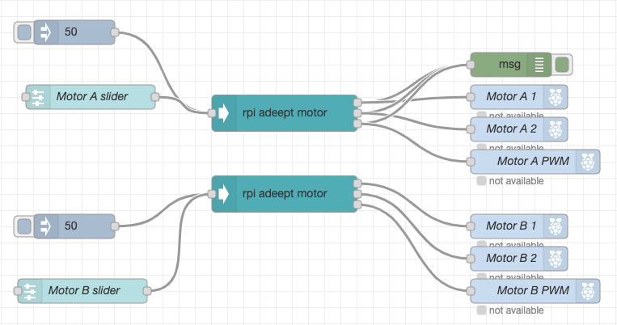

# node-red-contrib-rpi-adeept-motor

<!-- [](https://travis-ci.com/tmobile/node-red-contrib-rpi-adeept-motor)  [](https://www.npmjs.com/package/@tmus/node-red-contrib-rpi-adeept-motor) -->

This Node-RED node can receive the values in two different formats.  If it receives a simple number between 100 to -100 then it will translate the values into two control signals (Input 1 & 2) and the PWM, where X and Y are integer values. In this case, the motor will filter for the specific motor select in the configuration. If MotorA is select in the configuration, then X will be used to construct the INPUT and PWM values.

The second if a JSON object of the format ```{"MotorA": X, "MotorB": Y}```, 

The control signal are mapped to respective GPIO Pins:


|   |  GPIO Pin INPUT 1 | GPIO Pin INPUT 2  |  GPIO Pin PWM |   |
|---|---|---|---|---|
|  Motor A |  12 |  13 | 11  |   |
|  Motor B |  8 |  10 | 7   |  |





## Contribute Quick Start

Fork this repository, then:

```
git clone https://github.com/tmobile/node-red-contrib-rpi-adeept-motor.git
cd node-red-contrib-rpi-adeept-motor
npm run build
cd ~/.node-red
npm install <path to cloned repository> --save
node-red
```

When you're finished with your changes, merge requests are welcome!
